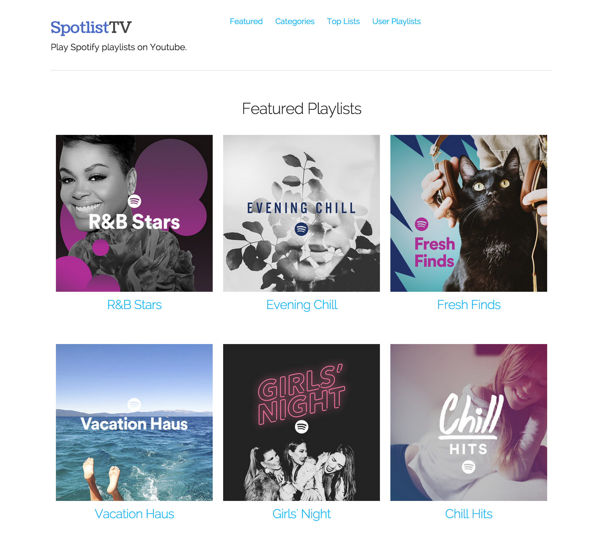

# SpotlistTV
Play Spotify Playlists on YouTube!

https://spotlist-tv.herokuapp.com



## Development
SpotlistTV is built with NodeJS 14+, Express, Backbone.

#### Register API Key
- https://developer.spotify.com/

#### Clone and install dependencies

```bash
$ git clone https://github.com/alfg/spotlistTV.git
$ cd spotlistTV
$ npm install
```

Open `config.js` and configure or set environment variables

```javascript
client_id: '<key>',  // Spotify API key.
client_secret: '<secret>',  // Spotify Secret Key.
redirect_uri: 'http://localhost:3000/callback',  // Spotify redirect URI.
castApplicationId: '<cast application id>', // Cast App ID. See Chromecast below.
castNamespace: '<cast namespace>' // Cast namespace. See Chromecast below.
```

Run server.
```bash
node server.js
```

#### Build Web Frontend
```bash
$ gulp
```

Frontend will now build and watch for changes. If you want to build without watching, use `gulp build`.

Visit `http://localhost:3000`


#### Chromecast
If you wish to hack on the custom Google Cast receiver, you'll need to register and whitelist (for debugging) your device and application to obtain an application ID.

https://developers.google.com/cast/docs/registration

Once registered, you can update `config.js` with your application ID and namespace.
You can use the default namespace, or create your own. The namespace can be anything as long as it starts with `urn:x-cast:`.

See the Google Cast documentation for more details on setup and debugging:
https://developers.google.com/cast/docs/developers

*If you wish to use my hosted receiver, feel free to leave the config as the defaults.*

## License
MIT
